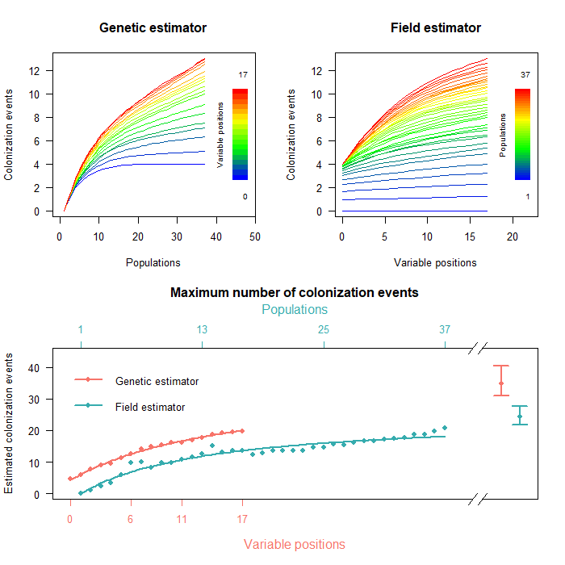

# PAICE: Phylogeographic Analysis of Island Colonization Events

<!-- badges: start -->

[](https://github.com/albertojcoello) [](https://onlinelibrary.wiley.com/doi/full/10.1111/jbi.14341) []([https://onlinelibrary.wiley.com/doi/full/10.1111/jbi.14341](https://cran.r-project.org/web/packages/PAICE/index.html))

<!-- badges: end -->

PAICE is designed to estimate the number of inter-island colonization events in a island-like system.

## Installation
The easy way to install PAICE is by the CRAN repository:

```r
install.packages("PAICE")
```

Additionally, it is possible to install PAICE using the **remotes** package:

``` r
install.packages("remotes")
remotes::install_github("PAICEcode/PAICE")
```

## Usage

PAICE allows a sampling effort correction for estimation of inter-islands colonization events in both field and genetic sampling.

The documentation of PAICE package is available [here](./PAICE_1.0.1.pdf).

<p align="center">



</p>
